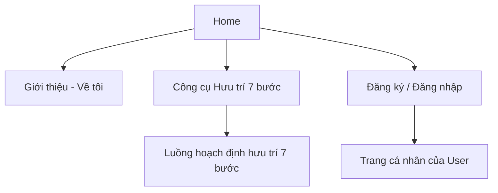
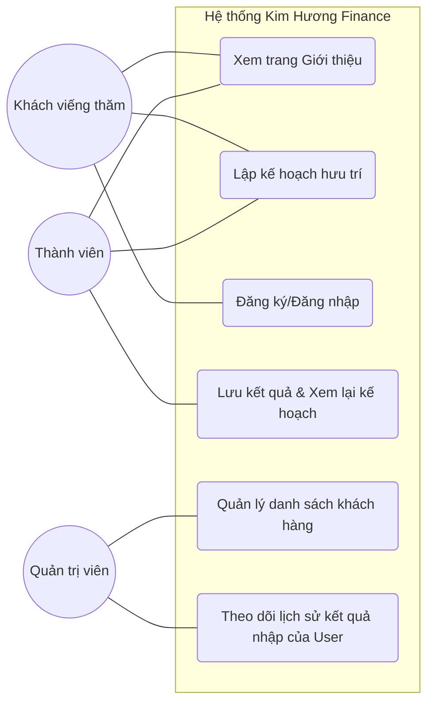
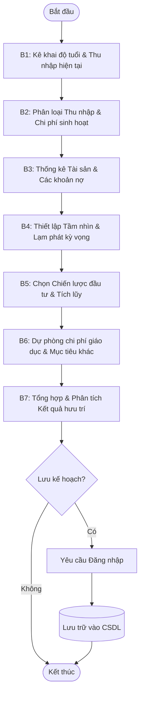

+-----------------------------------------------------------------------------------+------------------------------------------------------------------------+
| **BỘ GIÁO DỤC VÀ ĐÀO TẠO**                                                        | **CÔNG TY CỔ PHẦN DỊCH VỤ CÔNG NGHỆ LHD**                              |
|                                                                                   |                                                                        |
| **ĐẠI HỌC KINH TẾ TP. HỒ CHÍ MINH**                                               | *Số 4 Đường Bình Lợi, Phường Bình Lợi Trung, TP Hồ Chí Minh, Việt Nam* |
|                                                                                   |                                                                        |
| **TRƯỜNG KINH TẾ**                                                                |                                                                        |
+:=================================================================================:+:======================================================================:+
| {width="2.1093744531933507in" height="1.3975688976377953in"} | {width="1.21875in" height="1.21875in"}            |
+-----------------------------------------------------------------------------------+------------------------------------------------------------------------+

{width="8.55in" height="11.025in"}
**BÁO CÁO HỌC KÌ DOANH NGHIỆP
THỰC TẬP SINH BUSINESS ANALYST -- WEBSITE HOẠCH ĐỊNH TÀI CHÍNH & HƯU TRÍ**

---

  Họ và tên                           **Trần Thị Ngọc Huyền**

---

  Mã số sinh viên:                    **88214020018**

  Khóa                                **K2021_D4**

  Giảng viên hướng dẫn:               **Th.S Hồ Thị Thanh Tuyến**

Người hướng dẫn tại doanh nghiệp:   **Nguyễn Hữu Đạt**
-------------------------------------------------------------

**TP. Hồ Chí Minh, Ngày -- tháng 03 năm 2026**

# LỜI CẢM ƠN

Trong suốt quá trình học tập và rèn luyện tại Trường Kinh tế – Đại học Kinh tế TP. Hồ Chí Minh cũng như trong thời gian thực tập tốt nghiệp vừa qua, em đã nhận được rất nhiều sự quan tâm, hướng dẫn và hỗ trợ tận tình từ quý thầy cô, gia đình và đơn vị thực tập.

Trước hết, em xin gửi lời cảm ơn chân thành và sâu sắc nhất đến **Th.S Hồ Thị Thanh Tuyến** – giảng viên hướng dẫn trực tiếp của em. Cô đã luôn tận tâm định hướng, góp ý và hỗ trợ em từ những bước đầu tiên trong việc xác định đề tài cho đến khi hoàn thiện báo cáo này. Những chia sẻ, nhận xét chuyên môn quý báu của cô đã giúp em hiểu rõ hơn về phương pháp nghiên cứu và cách tiếp cận bài bản trong lĩnh vực phân tích nghiệp vụ.

Em cũng xin trân trọng cảm ơn **Công ty Cổ phần Dịch vụ Công nghệ LHD** – đặc biệt là **anh Nguyễn Hữu Đạt** (CEO) và toàn thể đội ngũ tại công ty – đã tạo cơ hội quý báu để em được tham gia thực tập và đóng góp vào dự án thiết kế website hoạch định tài chính và hoạch định tài chính Kim Hương Finance. Anh và các anh chị trong công ty đã nhiệt tình hướng dẫn, hỗ trợ và chia sẻ kinh nghiệm thực tế, giúp em tiếp cận môi trường làm việc chuyên nghiệp và tích lũy được những kỹ năng thực tiễn vô cùng thiết thực.

Cuối cùng, em xin gửi lời cảm ơn đến gia đình, bạn bè đã luôn động viên và đồng hành cùng em trong suốt thời gian học tập và thực tập.

Trong quá trình thực hiện báo cáo, mặc dù đã cố gắng hết sức, nhưng do kinh nghiệm thực tế còn hạn chế, báo cáo không tránh khỏi những thiếu sót. Em rất mong nhận được sự góp ý chân thành từ cô và quý công ty để em có thể hoàn thiện hơn.

Em xin chân thành cảm ơn!

*TP. Hồ Chí Minh, tháng 03 năm 2026*

*Sinh viên thực hiện*

**Trần Thị Ngọc Huyền**

# NHẬN XÉT CỦA DOANH NGHIỆP

# MỤC LỤC

[LỜI CẢM ƠN [2](#lời-cảm-ơn)](#lời-cảm-ơn)

[NHẬN XÉT CỦA DOANH NGHIỆP [3](#nhận-xét-của-doanh-nghiệp)](#nhận-xét-của-doanh-nghiệp)

[MỤC LỤC [4](#mục-lục)](#mục-lục)

[DANH MỤC TỪ VIẾT TẮT [5](#danh-mục-từ-viết-tắt)](#danh-mục-từ-viết-tắt)

[DANH MỤC HÌNH ẢNH [6](#danh-mục-hình-ảnh)](#danh-mục-hình-ảnh)

[CHƯƠNG 1: TỔNG QUAN [7](#chương-1-tổng-quan)](#chương-1-tổng-quan)

[1.1 Giới thiệu doanh nghiệp [7](#giới-thiệu-doanh-nghiệp)](#giới-thiệu-doanh-nghiệp)

[1.2 Mô tả vắn tắt công việc đã được làm [7](#mô-tả-vắn-tắt-công-việc-đã-được-làm)](#mô-tả-vắn-tắt-công-việc-đã-được-làm)

[1.3 Mong muốn từ doanh nghiệp [7](#mong-muốn-từ-doanh-nghiệp)](#mong-muốn-từ-doanh-nghiệp)

[1.4 Mong muốn từ sinh viên [7](#mong-muốn-từ-sinh-viên)](#mong-muốn-từ-sinh-viên)

[CHƯƠNG 2: NHẬT KÝ CÔNG VIỆC [8](#chương-2-nhật-ký-công-việc)](#chương-2-nhật-ký-công-việc)

[CHƯƠNG 3: CÔNG VIỆC (Nội dung chính) [10](#chương-3-công-việc-nội-dung-chính)](#chương-3-công-việc-nội-dung-chính)

[3.1 Hội nhập văn hoá doanh nghiệp và Nghiên cứu kiến thức nền tảng [10](#hội-nhập-văn-hoá-doanh-nghiệp-và-nghiên-cứu-kiến-thức-nền-tảng)](#hội-nhập-văn-hoá-doanh-nghiệp-và-nghiên-cứu-kiến-thức-nền-tảng)

[3.2 Phân tích yêu cầu và Xác định tính năng hệ thống [11](#phân-tích-yêu-cầu-và-xác-định-tính-năng-hệ-thống)](#phân-tích-yêu-cầu-và-xác-định-tính-năng-hệ-thống)

[3.3 Thiết kế cấu trúc và Luồng nghiệp vụ chi tiết [12](#thiết-kế-cấu-trúc-và-luồng-nghiệp-vụ-chi-tiết)](#thiết-kế-cấu-trúc-và-luồng-nghiệp-vụ-chi-tiết)

[3.4 Thiết kế giao diện (UI/UX) và Trải nghiệm người dùng [13](#thiết-kế-giao-diện-uiux-và-trải-nghiệm-người-dùng)](#thiết-kế-giao-diện-uiux-và-trải-nghiệm-người-dùng)

[3.5 Phân tích công thức tính toán và Xây dựng bộ test case đối soát [14](#phân-tích-công-thức-tính-toán-và-xây-dựng-bộ-test-case-đối-soát)](#phân-tích-công-thức-tính-toán-và-xây-dựng-bộ-test-case-đối-soát)

[3.6 Xây dựng tài liệu đặc tả yêu cầu phần mềm (PRD) [15](#xây-dựng-tài-liệu-đặc-tả-yêu-cầu-phần-mềm-prd)](#xây-dựng-tài-liệu-đặc-tả-yêu-cầu-phần-mềm-prd)

[3.7 Kiểm thử chấp nhận người dùng (UAT) và Quản lý lỗi [16](#kiểm-thử-chấp-nhận-người-dùng-uat-và-quản-lý-lỗi)](#kiểm-thử-chấp-nhận-người-dùng-uat-và-quản-lý-lỗi)

[3.8 Xây dựng tài liệu hướng dẫn và Bàn giao dự án [17](#xây-dựng-tài-liệu-hướng-dẫn-và-bàn-giao-dự-án)](#xây-dựng-tài-liệu-hướng-dẫn-và-bàn-giao-dự-án)

[CHƯƠNG 4: KẾT LUẬN [18](#chương-4-kết-luận)](#chương-4-kết-luận)

[4.1 Kết quả đạt được sau thực tập [18](#kết-quả-đạt-được-sau-thực-tập)](#kết-quả-đạt-được-sau-thực-tập)

[4.2 Bài học kinh nghiệm [19](#bài-học-kinh-nghiệm)](#bài-học-kinh-nghiệm)

[4.3 Tổng kết [20](#tổng-kết)](#tổng-kết)

# DANH MỤC TỪ VIẾT TẮT

| **STT** | **Ký hiệu** | **Tên đầy đủ**                                                        |
| ------------- | ------------------- | -------------------------------------------------------------------------------- |
| 1             | BA                  | Business Analyst – Phân tích nghiệp vụ                                      |
| 2             | UI                  | User Interface – Giao diện người dùng                                       |
| 3             | UX                  | User Experience – Trải nghiệm người dùng                                   |
| 4             | SRS                 | Software Requirements Specification – Tài liệu đặc tả yêu cầu phần mềm |
| 5             | ERD                 | Entity Relationship Diagram – Sơ đồ quan hệ thực thể                      |
| 6             | CSDL                | Cơ sở dữ liệu                                                                |
| 7             | CMS                 | Content Management System – Hệ thống quản lý nội dung                      |
| 8             | TMĐT               | Thương mại điện tử                                                         |
| 9             | API                 | Application Programming Interface – Giao diện lập trình ứng dụng           |
| 10            | CRUD                | Create, Read, Update, Delete – Các thao tác cơ bản with dữ liệu           |
| 11            | HTML                | HyperText Markup Language – Ngôn ngữ đánh dấu siêu văn bản              |
| 12            | CSS                 | Cascading Style Sheets – Ngôn ngữ định dạng trang web                      |
| 13            | Fintech             | Financial Technology – Công nghệ tài chính                                  |
| 14            | Next.js             | Framework phát triển Web dựa trên React                                      |
| 15            | Tailwind            | Tailwind CSS – Framework CSS tiện ích (Utility-first CSS)                     |

# DANH MỤC HÌNH ẢNH

*(Danh mục hình ảnh sẽ được cập nhật sau khi bổ sung hình minh họa vào báo cáo)*

Hình 1: Giao diện trang chủ website Kim Hương Finance

Hình 2: Sơ đồ Use Case tổng quát của hệ thống

Hình 3: Sơ đồ Activity Diagram – Luồng hoạch định hưu trí 7 bước

Hình 4: Sơ đồ ERD (Entity Relationship Diagram) của cơ sở dữ liệu

Hình 5: Sitemap cấu trúc tổng thể website

Hình 6: Mockup giao diện trang chủ (Figma)

Hình 7: Mockup giao diện công cụ tính toán hưu trí

Hình 8: Mockup giao diện đăng ký/đăng nhập và lưu kế hoạch

Hình 9: Giao diện website trên thiết bị di động

Hình 10: Kết quả kiểm thử – Danh sách lỗi (Log bug)

# CHƯƠNG 1: TỔNG QUAN

## 1.1 Giới thiệu doanh nghiệp

### 1.1.1 Thông tin chung

**Công ty Cổ phần Dịch vụ Công nghệ LHD** (LHD TECH) là một công ty công nghệ chuyên cung cấp các giải pháp phần mềm tùy chỉnh và tư vấn chiến lược chuyển đổi số cho doanh nghiệp. Công ty tự định vị là đơn vị tiên phong trong văn hóa **"AI-First"** tại Việt Nam – hướng đến việc tích hợp trí tuệ nhân tạo vào mọi quy trình vận hành của doanh nghiệp một cách toàn diện.

| **Thông tin** | **Chi tiết**                                                                 |
| -------------------- | ----------------------------------------------------------------------------------- |
| Tên công ty        | Công ty Cổ phần Dịch vụ Công nghệ LHD                                        |
| Tên thương mại   | LHD TECH                                                                            |
| Website              | https://lhd-software.com/                                                           |
| Địa chỉ           | Số 4, Đường Bình Lợi, Phường Bình Lợi Trung, TP. Hồ Chí Minh, Việt Nam |
| Email                | sales@lhd-software.com                                                              |
| CEO                  | Nguyễn Hữu Đạt                                                                  |
| Lĩnh vực           | Phần mềm, Công nghệ thông tin, Thương mại điện tử, AI                    |

Sứ mệnh của LHD TECH là **kiến tạo hệ sinh thái thông minh**, đồng hành cùng doanh nghiệp chuyển đổi số with tư duy AI-First. Công ty tự hào là đối tác tin cậy trong các dự án quy mô lớn cho các tổ chức tài chính – ngân hàng hàng đầu và các tập đoàn bán lẻ đa quốc gia.

### 1.1.2 Các sản phẩm và dịch vụ

LHD TECH cung cấp một hệ sinh thái sản phẩm và giải pháp công nghệ đa dạng, tập trung mạnh mẽ vào các lĩnh vực như thương mại điện tử, trí tuệ nhân tạo (AI) và quản trị doanh nghiệp. Trong nhóm sản phẩm cốt lõi, công ty phát triển các nền tảng Commerce và bán lẻ hiện đại để hỗ trợ doanh nghiệp quản lý bán hàng đa kênh hiệu quả. Đối với mảng AI, đơn vị này tiên phong with các giải pháp AI Agentic Hub, AI Chatbot và AI Orchestrator nhằm tích hợp trí tuệ nhân tạo sâu rộng vào quy trình vận hành trực tiếp. Song song đó, các hệ sinh thái quản trị hiện đại bao gồm Self-Service Portal, báo cáo PowerBI và hệ thống quản trị nội dung (CMS) cũng đóng vai trò quan trọng trong danh mục dịch vụ.

Về mặt giải pháp theo ngành, LHD TECH triển khai các dự án chuyên sâu cho lĩnh vực Tài chính – Ngân hàng, các doanh nghiệp quy mô Enterprise, ngành bán lẻ và mảng Y tế – Healthcare. Toàn bộ quá trình triển khai sản phẩm tại đây đều được thực hiện thông qua một quy trình 6 bước chuẩn hóa, đi từ khâu khảo sát nhu cầu ban đầu và lập kế hoạch tổng thể (Master Plan). Sau đó, đội ngũ chuyên gia sẽ tiến hành phân tích thiết kế, phát triển xây dựng, kiểm thử triển khai trước khi bước vào giai đoạn cuối là giám sát và tối ưu hóa hệ thống một cách liên tục.

### 1.1.3 Cơ cấu tổ chức doanh nghiệp

LHD TECH được vận hành theo mô hình chức năng with sự phân chia nhiệm vụ rõ ràng giữa các bộ phận để đảm bảo tính chuyên môn hóa cao nhất trong từng dự án công nghệ. Đứng đầu tổ chức là Ban Giám đốc do CEO Nguyễn Hữu Đạt trực tiếp điều hành, chịu trách nhiệm chính trong việc đề ra các định hướng chiến lược và phát triển các sản phẩm trọng tâm của công ty. Để hiện thực hóa các ý tưởng công nghệ, Bộ phận Kỹ thuật (Engineering) đóng vai trò nòng cốt trong việc xây dựng kiến trúc hệ thống, phát triển phần mềm và tích hợp các giải pháp trí tuệ nhân tạo tiên tiến.

Song hành cùng bộ phận kỹ thuật là Bộ phận Phân tích nghiệp vụ (BA), nơi chịu trách nhiệm khảo sát các yêu cầu thực tế từ khách hàng, thiết kế quy trình kinh doanh và biên soạn các tài liệu đặc tả kỹ thuật chi tiết. Ngoài ra, cơ cấu tổ chức của LHD TECH còn bao gồm Bộ phận Thiết kế (UI/UX) đảm nhận việc tối ưu hóa giao diện và trải nghiệm người dùng; Bộ phận Kinh doanh & Marketing thực hiện tư vấn khách hàng và phát triển thị trường; cùng Bộ phận Kiểm thử (QA/QC) nhằm đảm bảo mọi sản phẩm đều đạt chất lượng cao nhất trước khi ra mắt thị trường. Mô hình tổ chức này giúp các dự án của công ty luôn được vận hành một cách nhịp nhàng và hiệu quả.

## 1.2 Mô tả vắn tắt công việc đã được làm

Trong thời gian thực tập tại Công ty Cổ phần Dịch vụ Công nghệ LHD with vị trí **Business Analyst – Website Tài chính & Hưu trí**, em đã được tham gia trực tiếp vào dự án xây dựng **website Kim Hương Finance** – một website tích hợp công cụ hoạch định tài chính và hưu trí chuyên nghiệp.

Cụ thể, các công việc em đã thực hiện bao gồm:

- **Nghiên cứu lĩnh vực** (Domain Research): Tìm hiểu về kiến thức tài chính cá nhân, quy trình hoạch định hưu trí, các chỉ số lạm phát, lãi suất và nhu cầu tiết kiệm của người dùng.
- **Phân tích yêu cầu** (Requirement Analysis): Tham gia vào các phần khảo sát nhu cầu người dùng, xây dựng danh sách tính năng (Feature List) và đặc tả yêu cầu cho công cụ tính toán hưu trí 7 bước.
- **Vẽ sơ đồ nghiệp vụ**: Tham gia vẽ Activity Diagram, mô tả luồng tính toán tài chính và lưu trữ thông tin của người dùng.
- **Thiết kế cơ sở dữ liệu**: Phụ trách thu thập dữ liệu về các bài viết chuyên sâu về tài chính.
- **Tham gia thiết kế UI/UX**: Hỗ trợ thiết kế Wireframe và Mockup trên Figma, lựa chọn tông màu chuyên nghiệp, tin cậy (Xanh dương – Trắng – Xám).
- **Lập trình và triển khai**: Tham gia theo dõi, cập nhật tiến độ cho PM và kiểm thử logic tính toán.

## 1.3 Mong muốn từ doanh nghiệp

Trong quá trình tiếp nhận sinh viên thực tập, Công ty LHD TECH đặt ra những kỳ vọng cụ thể nhằm hỗ trợ tối đa cho sự phát triển của sinh viên đồng thời mang lại giá trị thực tế cho các dự án của doanh nghiệp. Trước hết, công ty mong muốn sinh viên có thể đóng góp trực tiếp vào quá trình phân tích nghiệp vụ, thiết kế và xây dựng website Kim Hương Finance – một dự án quan trọng kết hợp giữa nội dung số và các công cụ tài chính chuyên sâu. Để thực hiện tốt nhiệm vụ này, sinh viên cần chủ động nghiên cứu các lĩnh vực đặc thù như tài chính cá nhân, bảo hiểm và đầu tư để đảm bảo tính chính xác và tin cậy cho nền tảng nội dung của website.

Bên cạnh đó, việc vận dụng linh hoạt các kỹ năng học thuật đã được đào tạo tại trường như phân tích nghiệp vụ, thiết kế cơ sở dữ liệu và tư duy sản phẩm vào môi trường làm việc thực tiễn là một yêu cầu then chốt. Công ty cũng đặc biệt đề cao khả năng làm việc độc lập, tinh thần tự chủ trong nghiên cứu và sự chủ động trong việc giao tiếp, trình bày kết quả with người hướng dẫn (Mentor) khi gặp khó khăn. Cuối cùng, sinh viên cần đảm bảo hoàn thành các đầu việc được giao đúng thời hạn, cam kết chất lượng sản phẩm đầu ra luôn đạt tiêu chuẩn chuyên nghiệp mà công ty đã đề ra.

## 1.4 Mong muốn từ sinh viên

Với tư cách là sinh viên thực tập, em xác định kỳ thực tập tại LHD TECH là cơ hội quý báu để trải nghiệm và trưởng thành trong một môi trường làm việc công nghệ chuyên nghiệp. Mục tiêu hàng đầu của em là thấu hiểu sâu sắc cách thức vận hành của một doanh nghiệp trong thực tế, từ quy trình phối hợp nhóm, quản lý dự án cho đến các kỹ năng giao tiếp chuyên môn with Mentor và các thành viên khác. Thông qua việc tham gia trực tiếp vào dự án website Kim Hương Finance, em mong muốn được rèn luyện và áp dụng thành thạo các kỹ thuật phân tích nghiệp vụ chuyên sâu như xây dựng sơ đồ Use Case, Activity Diagram, thiết kế ERD và biên soạn tài liệu đặc tả SRS.

Đồng thời, việc nắm vững quy trình phát triển phần mềm khép kín từ khâu phân tích yêu cầu, thiết kế giao diện đến kiểm thử và triển khai sản phẩm sẽ giúp em củng cố nền tảng kiến thức chuyên môn một cách vững chắc nhất. Hơn cả một mục tiêu học tập, em hy vọng có thể đóng góp công sức vào việc tạo ra một sản phẩm công nghệ có ý nghĩa thực tiễn, giúp người dùng chủ động hơn trong việc quản lý tài chính và chuẩn bị lộ trình hưu trí bền vững. Những kinh nghiệm, kỹ năng và mối quan hệ chuyên môn tích lũy được trong thời gian này sẽ là hành trang quan trọng, làm nền tảng vững chắc cho định hướng sự nghiệp trở thành một chuyên viên Phân tích nghiệp vụ (BA) trong tương lai.

# CHƯƠNG 2: NHẬT KÝ CÔNG VIỆC

| Tuần (TT) | Thời gian    | Nội dung công việc                                                                                                                                             | Kết quả đạt được / Ghi chú                                                    |
| ---------- | ------------- | ----------------------------------------------------------------------------------------------------------------------------------------------------------------- | ------------------------------------------------------------------------------------- |
| Tuần 1    | 05/01         | Gặp mặt Mentor, tiếp nhận đề tài và cài đặt môi trường làm việc.Tìm hiểu quy định công ty và văn hóa doanh nghiệp.                       | Cài đặt xong Git, VS Code.Hiểu rõ nội quy công ty.                             |
| ``  | 07/01         | Nghiên cứu tổng quan về đề tài: Tài chính cá nhân và hưu trí.                                                                                       | Liệt kê các yếu tố ảnh hưởng đến kế hoạch hưu trí (Tuổi, Chi phí...). |
| ``  | 09/01         | Khảo sát thị trường: Phân tích các bộ công cụ tính toán tài chính.Xác định nhóm khách hàng mục tiêu (Người lao động, người trẻ...). | Hiểu rõ chân dung khách hàng mục tiêu.                                         |
| Tuần 2    | 12/01         | Xác định yêu cầu cho công cụ tính toán hưu trí (7 bước).Lên danh sách tính năng: Nhập thu nhập, tài sản, nợ, hoạch định.                 | Danh sách chức năng (Feature List).                                                |
| ``  | 14/01         | Phân tích nghiệp vụ: Vẽ sơ đồ Use Case cho hệ thống.Xác định các Actor (Người dùng, Admin).                                                      | Hoàn thành Use Case Diagram.                                                        |
| ``  | 16/01         | Phân tích chi tiết quy trình "Hoạch định hưu trí 7 bước".                                                                                              | Nội dung các bước cần nhập.                                                     |
| Tuần 3    | 19/01         | Vẽ sơ đồ hoạt động (Activity Diagram).                                                                                                                     | Sơ đồ luồng nghiệp vụ chính.                                                   |
| ``  | 21/01         | Xây dựng cấu trúc website cùng khách và PM.                                                                                                                | Có được các mục tính năng chính và sketch layout website.                   |
| ``  | 23/01         | Thiết kế giao diện.                                                                                                                                            | Bản mockup trang chủ, về tôi.                                                     |
| Tuần 4    | 26/01         | Chọn tone màu.Đọc hiểu bảng công thức tính mà khách gửi.                                                                                              | Chốt được tone màu.                                                              |
| ``  | 28/01         | Thiết kế bảng tính.                                                                                                                                           | Mockup các phần tính toán.                                                        |
| ``  | 30/01         | Đọc hiểu lại công thức và làm 1 test case with khách để test lại công thức code.                                                                    | Ra được 1 bảng tính có số liệu mẫu.                                          |
| Tuần 5    | 02/02         | Hỗ trợ viết PRD cho dự án.                                                                                                                                   | Viết phần tổng quan dự án.                                                       |
| ``  | 04/02         | Cập nhật PRD phần "Yêu cầu phi chức năng" (Security, Accuracy)                                                                                             | Hoàn thiện tiêu chuẩn chất lượng sản phẩm.                                   |
| ``  | 06/02         | Thiết kế mockup cho công cụ hưu trí (Bước 1 & 2: Thu nhập/Chi phí).                                                                                     | Hoàn thành giao diện nhập liệu bước đầu.                                     |
| Tuần 6    | 09/02         | Test công thức tính toán hưu trí trên Excel để đối soát hệ thống.                                                                                   | Đảm bảo logic tính toán chính xác tuyệt đối.                                |
| ``  | 11/02         | Hoàn thiện mockup cho toàn bộ 7 bước của công cụ trên Figma.                                                                                            | Hoàn thành bộ thiết kế UI cho công thức.                                       |
| ``  | 13/02         | Phụ PM rà soát tổng thể PRD trước khi bàn giao cho đội Dev.                                                                                             | Tài liệu PRD sẵn sàng để lập trình.                                           |
| Nghỉ Tết | 16 - 22/02    | NGHỈ TẾT NGUYÊN ĐÁN BÍNH NGỌ 2026                                                                                                                          | ``                                                                             |
| Tuần 7    | 23/02         | Kiểm tra lại công thức sau khi Dev tích hợp vào hệ thống.                                                                                                | Phát hiện và báo cáo các lỗi sai lệch số liệu.                              |
| ``  | 25/02         | Viết tài liệu hướng dẫn sử dụng (User Guide) cho người dùng cuối.                                                                                     | Lên sườn cho hướng dẫn sử dụng                                                |
| ``  | 27/02         | Viết tài liệu hướng dẫn sử dụng (User Guide) cho người dùng cuối.                                                                                     | Hoàn thành hướng dẫn sử dụng.                                                  |
| Tuần 8    | 02/03         | Test công thức phần Lợi nhuận đầu tư và Kịch bản hưu trí sớm.                                                                                       | Đảm bảo hệ thống chạy ổn.                                                      |
| ``  | 04/03         | Cập nhật PRD các trường hợp biên (Edge cases) khi dữ liệu trống.                                                                                        | Bổ sung edge case cho PRD                                                            |
| ``  | 06/03         | Tổng kiểm thử (UAT) luồng 7 bước hoàn chỉnh.                                                                                                              | Sản phẩm chạy ổn định đúng yêu cầu nghiệp vụ.                             |
| Tuần 9    | 09/03         | Viết báo cáo lỗi (Bug log) về mặt UI/UX cho đội dev fix.                                                                                                  | Các lỗi hiển thị được xử lý.                                                 |
| ``  | 11/03         | Hoàn thiện tài liệu PRD bản cuối cùng phụ giúp PM.                                                                                                       | ``                                                                             |
| ``  | 13/03         | Viết báo cáo thực tập Chương 1 & 2                                                                                                                         | Draft báo cáo gửi Mentor tại công ty review.                                     |
| Tuần 10   | 16/03         | Mentor review báo cáo thực tập và góp ý chỉnh sửa.                                                                                                       | Chỉnh sửa báo cáo theo hướng dẫn.                                              |
| ``  | 18/03         | Hoàn tất báo cáo.                                                                                                                                             | ``                                                                             |
| ``  | 20/03         | Xin dấu xác nhận thực tập.Bàn giao tài liệu cho công ty.                                                                                                 | Phiếu đánh giá thực tập có dấu mộc.                                          |
| Wrap-up    | 23/03 - 30/03 | Nộp báo cáo cho giảng viên review.Nộp báo cáo về khoa/trường.Xử lý các thủ tục hành chính sau thực tập.                                       | Hoàn tất môn Thực tập tốt nghiệp.                                              |

# CHƯƠNG 3: CÔNG VIỆC (Nội dung chính)

*Chương này trình bày chi tiết các công việc, quy trình nghiên cứu, phân tích và triển khai giải pháp cho dự án Website tài chính Kim Hương Finance mà sinh viên đã thực hiện trong suốt quá trình thực tập.*

## 3.1 Hội nhập văn hoá doanh nghiệp và Nghiên cứu kiến thức nền tảng

### 3.1.1 Mục tiêu công việc
Mục tiêu hàng đầu của em trong giai đoạn này là nhanh chóng hòa nhập với môi trường làm việc chuyên nghiệp tại LHD TECH, nắm vững các quy định nội bộ và thấu hiểu văn hóa "AI-First" mà công ty đang theo đuổi. Bên cạnh đó, em đã bắt đầu tiếp cận và làm quen với các công cụ công nghệ hiện đại phục vụ cho dự án như GitHub và Visual Studio Code, đồng thời dành thời gian nghiên cứu sâu về kiến thức nền tảng trong lĩnh vực tài chính cá nhân và hoạch định hưu trí. Đây là bước chuẩn bị vô cùng quan trọng để em xây dựng nền tảng tư duy phân tích nghiệp vụ (BA) cho các giai đoạn triển khai thực tế tiếp theo của dự án Kim Hương Finance.

### 3.1.2 Đầu vào công việc
Để bắt đầu công việc, em đã được các anh chị tại công ty cung cấp hệ thống nội quy, quy trình làm việc Agile và các tài liệu đào tạo nội bộ cần thiết. Mentor đã trực tiếp bàn giao cho em đề tài thực tập cùng những yêu cầu sơ bộ từ phía khách hàng về website tài chính. Ngoài ra, đầu vào của em còn bao gồm các nguồn dữ liệu tin cậy về kinh tế học như tỷ lệ lạm phát, các công thức tính lãi suất kép và các báo cáo nghiên cứu về nhu cầu chi tiêu của người cao tuổi tại Việt Nam mà em đã chủ động khai thác từ các nguồn thông tin chính thống trên internet.

### 3.1.3 Chi tiết
Trong những tuần thực tập đầu tiên, em tập trung tìm hiểu sâu về văn hóa doanh nghiệp và quy trình phối hợp dự án thông qua hệ thống quản lý mã nguồn GitHub và trình soạn thảo VS Code. Một trải nghiệm thực sự thú vị đối với em là được tiếp cận và học cách cộng tác hiệu quả với trợ lý AI Antigravity để tối ưu hóa việc phân cứu thông tin cũng như soạn thảo các tài liệu đặc tả ban đầu. Về mặt kiến thức chuyên môn, em đã dành nhiều thời gian nghiên cứu các biến số tài chính ảnh hưởng trực tiếp đến lộ trình tích lũy hưu trí, đồng thời khảo sát kỹ các công cụ tính toán của những tổ chức tài chính lớn trên thế giới để rút ra kinh nghiệm cho việc thiết kế bộ máy tính hưu trí 7 bước sau này.

### 3.1.4 Cách thực hiện
Em thực hiện các đầu việc được giao thông qua việc tham gia đầy đủ các buổi họp định hướng (Orientation) và thường xuyên trao đổi trực tiếp cùng Mentor để nắm bắt kịp thời quy trình vận hành dự án. Việc làm quen với các công cụ kỹ thuật được em tiến hành bằng cách thực hành trực tiếp trên VS Code và GitHub dưới sự hướng dẫn chỉ bảo tận tình của Mentor, đồng thời tận dụng sự hỗ trợ đắc lực từ Antigravity để giải đáp nhanh các thắc mắc chuyên môn. Để mở rộng kiến thức hưu trí, em đã áp dụng phương pháp phân tích đối thủ (Benchmarking) và tổng hợp thành các báo cáo nghiên cứu thị trường. Kết thúc giai đoạn này, em đã có những buổi thảo luận định kỳ với Mentor để thống nhất chân dung khách hàng mục tiêu và các tham số tài chính cốt lõi nhất.
## 3.2 Phân tích yêu cầu và Xác định tính năng hệ thống

### 3.2.1 Mục tiêu công việc
Mục tiêu chính của em trong giai đoạn này là xác định rõ rệt các chức năng cốt lõi của website Kim Hương Finance, đặc biệt là bộ máy tính toán hưu trí – "linh hồn" của dự án. Em cần hiểu rõ người dùng cần gì khi truy cập vào một website hoạch định tài chính cá nhân và những tính năng nào sẽ thực sự giúp họ giải quyết bài toán hoạch định tương lai, từ đó làm cơ sở vững chắc cho việc thiết kế và lập trình sau này.

### 3.2.2 Đầu vào của công việc
Để thực hiện việc phân tích, em đã dựa trên các kết quả nghiên cứu thị trường và chân dung khách hàng mà em đã tìm hiểu ở mục 3.1. Đồng thời, em cũng tiếp nhận các ý tưởng sơ bộ từ khách hàng về một quy trình "Hoạch định 7 bước" chuyên sâu. Các tài liệu tham khảo về công thức tài chính và các yêu cầu về mặt thương hiệu "Kim Hương (Sarah) Finance" cũng là những dữ liệu đầu vào quan trọng để em định hình các tính năng cần thiết cho nền tảng.

### 3.2.3 Chi tiết
Dưới đây là các bảng tổng hợp yêu cầu mà em đã phân tích và hệ thống hóa lại cho dự án website Kim Hương Finance:

**Bảng 1: Yêu cầu Chức năng (Functional Requirements)**

| STT | Nhóm chức năng | Mô tả chi tiết |
| --- | --- | --- |
| 2 | Hoạch định 7 bước | Luồng nhập liệu từ Thông tin cơ bản -> Thu nhập/Chi phí -> Tài sản/Nợ -> Tầm nhìn -> Tiết kiệm -> Giáo dục -> Kết quả. |
| 3 | Tính toán Real-time | Cập nhật ngay lập tức các chỉ số tài chính khi người dùng thay đổi dữ liệu đầu vào. |
| 4 | Đa ngôn ngữ | Hỗ trợ chuyển đổi giao diện linh hoạt giữa Tiếng Việt và Tiếng Anh (VI/EN). |
| 5 | Quản lý tài khoản | Cho phép người dùng đăng ký, đăng nhập để lưu trữ và xem lại các kế hoạch đã lập. |

**Bảng 2: Yêu cầu Kỹ thuật (Technical Requirements)**

| STT | Thành phần | Công nghệ/Giải pháp |
| --- | --- | --- |
| 1 | Frontend Framework | React / Next.js (tối ưu hóa SEO và tốc độ tải trang). |
| 2 | Styling | Tailwind CSS (đảm bảo tính hiện đại và tương thích di động). |
| 3 | Visualisation | Thư viện biểu đồ (Recharts/Chart.js) để mô phỏng biểu đồ tăng trưởng tài sản. |
| 4 | Deployment | Triển khai trên nền tảng Vercel để đảm bảo độ ổn định cao. |
| 5 | Version Control | Quản lý mã nguồn thông qua hệ thống Git và GitHub. |

**Bảng 3: Yêu cầu Phi chức năng (Non-functional Requirements)**

| STT | Tiêu chí | Yêu cầu chi tiết |
| --- | --- | --- |
| 1 | Độ chính xác | Các công thức lãi kép, lạm phát phải khớp tuyệt đối với kết quả tính toán trên Excel đối soát. |
| 2 | Trải nghiệm (UX) | Luồng 7 bước phải mượt mà, có thanh tiến độ hướng dẫn người dùng không bị "ngợp" thông tin. |
| 3 | Hiệu năng | Thời gian phản hồi của công cụ tính toán và tải trang dưới 2 giây. |
| 4 | Tính thẩm mỹ | Giao diện chuyên nghiệp, tông màu tin cậy, phù hợp với lĩnh vực tài chính cá nhân. |
| 5 | Bảo mật | Thông tin cá nhân và số liệu tài chính của người dùng phải được bảo vệ an toàn. |

### 3.2.4 Cách thực hiện
Để hoàn thành mục này, em đã sử dụng phương pháp liệt kê và phân loại yêu cầu thành nhóm chức năng, kỹ thuật và phi chức năng. Em dành thời gian quan sát các thao tác người dùng mong muốn trên trang thực tế để xây dựng danh sách tính năng (Feature List). Sau đó, em tiến hành vẽ sơ đồ Use Case tổng quát để trực quan hóa phạm vi hệ thống, đảm bảo không bỏ sót bất kỳ tương tác quan trọng nào. Cuối cùng, em cũng phối hợp định kỳ cùng Mentor để rà soát toàn bộ tài liệu, đảm bảo tính khả thi về mặt kỹ thuật cho dự án.
## 3.3 Thiết kế cấu trúc và Luồng nghiệp vụ chi tiết

### 3.3.1 Mục tiêu công việc
Mục tiêu cốt lõi của em trong phần này là kiến tạo nên bộ "khung xương" vững chắc cho toàn bộ dự án Kim Hương Finance. Em cần định hình rõ ràng cấu trúc các màn hình (Screen Flow) để tối ưu hóa trải nghiệm điều hướng, đồng thời chuẩn hóa các luồng nghiệp vụ phức tạp của bộ tính toán hưu trí. Thông qua việc mô hình hóa bằng sơ đồ, em có thể đảm bảo mọi tương tác của người dùng, từ xem giới thiệu đến nhập liệu tài chính, đều diễn ra một cách logic và mượt mà nhất.

### 3.3.2 Đầu vào của công việc
Để thực hiện bước thiết kế này, em đã dựa vào danh sách tính năng (Feature List) và các bảng yêu cầu đã phân tích ở mục 3.2. Ngoài ra, em cũng căn cứ vào quy trình nghiệp vụ "Hoạch định hưu trí 7 bước" chi tiết do khách hàng cung cấp. Các kiến thức về luồng quản trị nội dung (CMS) và quản trị người dùng cũng được em tích hợp vào sơ đồ Use Case để đảm bảo hệ thống có khả năng quản lý danh sách khách hàng và lịch sử kết quả của Admin một cách hiệu quả.

### 3.3.3 Chi tiết
Em xin trình bày 03 sơ đồ trọng tâm mà em đã thiết kế để đặc tả cấu trúc và nghiệp vụ của hệ thống:

**1. Sơ đồ Cấu trúc trang (Screen Flow / Sitemap)**
Sơ đồ này mô tả cách sắp xếp các trang và luồng di chuyển chính mà em đã đề xuất cho website:

**2. Sơ đồ Use Case tổng quát**
Sơ đồ này thể hiện mối quan hệ giữa các tác nhân (Khách viếng thăm, Thành viên, Admin) và các chức năng của website:

**3. Sơ đồ luồng nghiệp vụ (BPMN Flow) - Tính toán hưu trí**
Đây là luồng xử lý chi tiết qua 7 bước mà em đã phân tích cho bộ máy tính tài chính:

### 3.3.4 Cách thực hiện
Em đã sử dụng công cụ Mermaid.js để trực quan hóa các luồng nghiệp vụ này ngay trong tài liệu đặc tả. Quy trình thực hiện của em bao gồm việc phác thảo Screen Flow để xác định tính liên kết giữa các trang, sau đó em phân tích vai trò của Admin và User để xây dựng sơ đồ Use Case. Đặc biệt, em đã tập trung mô phỏng luồng 7 bước tính toán thành sơ đồ BPMN để kiểm tra logic dữ liệu và các rẽ nhánh khi người dùng thực hiện lưu kết quả. Mọi sơ đồ đều được em thảo luận và chỉnh sửa nhiều lần cùng Mentor để đảm bảo tính khả thi về mặt lập trình.
## 3.4 Thiết kế giao diện (UI/UX) và Trải nghiệm người dùng

### 3.4.1 Mục tiêu công việc
Mục tiêu chính của em trong giai đoạn này là hiện thực hóa các yêu cầu nghiệp vụ thành một giao diện trực quan, chuyên nghiệp và đầy cảm hứng. Trong lĩnh vực tài chính cá nhân, giao diện không chỉ cần đẹp mà còn phải khơi gợi được niềm tin (Trust) và sự an tâm cho người dùng. Em muốn tạo ra một không gian số nơi khách hàng cảm thấy việc lập kế hoạch hưu trí là một hành trình thú vị và đầy hy vọng, chứ không phải là những con số khô khan.

### 3.4.2 Đầu vào của công việc
Để bắt đầu thiết kế, em căn cứ vào sơ đồ Sitemap và các luồng nghiệp vụ đã thống nhất ở mục 3.3. Ngoài ra, em cũng nghiên cứu các xu hướng thiết kế giao diện hiện đại (Modern UI) trong ngành Fintech, đồng thời lắng nghe những chia sẻ về phong cách cá nhân của chị Kim Hương để đảm bảo website mang đậm dấu ấn thương hiệu riêng – nhẹ nhàng, chân thành nhưng vẫn rất chuyên gia.

### 3.4.3 Chi tiết
Trong phần này, em đã trực tiếp thực hiện bản thiết kế Mockup trên phần mềm Figma và tư vấn hệ thống nhận diện hình ảnh cho dự án với các chi tiết cụ thể như sau:

**1. Hệ thống màu sắc (Color Palette) và Font chữ:**
Em đã tư vấn cho khách hàng sử dụng bộ nhận diện "Sterling Ledger" với các thông số kỹ thuật:
- **Màu chủ đạo (Primary - #1E3A5F):** Tông xanh đại dương sâu thẳm được em chọn làm màu nền chính cho các thanh điều hướng và đề mục trọng tâm nhằm tạo cảm giác tin cậy, vững chãi và ổn định.
- **Màu nhấn (Secondary - #DC2626):** Màu đỏ đỏ năng lượng được em sử dụng tinh tế cho các nút hành động (CTA) như "Lập kế hoạch ngay" hay các con số cảnh báo, giúp thu hút sự chú ý của người dùng.
- **Font chữ:** Em kết hợp giữa kiểu chữ Serif (có chân) cho các tiêu đề chính để tạo vẻ sang trọng, cổ điển và kiểu chữ Sans-serif (không chân) cho phần nội dung để đảm bảo tính dễ đọc trên mọi thiết bị.

**2. Thiết kế các màn hình trọng tâm:**
- **Trang chủ (Homepage):** Em thiết kế phần Hero Section với slogan đầy ý nghĩa: *"Nghỉ hưu không phải là kết thúc, mà là khởi đầu của tự do"*. Phía dưới là các khối thông tin tóm tắt về kinh nghiệm và sứ mệnh của dự án để củng cố niềm tin cho khách viếng thăm.
- **Trang Giới thiệu (Về tôi):** Bố cục được em sắp xếp trang trọng để trình bày tiểu sử, các cột mốc sự nghiệp và sứ mệnh "Hành trình khởi nghiệp tài chính" của chị Kim Hương.
- **Công cụ Hưu trí (Calculator UI):** Đây là phần em dành nhiều tâm huyết nhất với giao diện tối giản, các biểu đồ trực quan và thanh tiến độ rõ ràng giúp người dùng dễ dàng theo dõi từng bước trong lộ trình 7 bước hoạch định tương lai tài chính.

### 3.4.4 Cách thực hiện
Em đã tiến hành xây dựng các Component và Grid System trên Figma để đảm bảo tính nhất quán (Consistency) cho toàn bộ website. Trong quá trình thiết kế, em luôn chú trọng đến tính Responsive để giao diện hiển thị mượt mà trên cả máy tính lẫn thiết bị di động. Sau khi hoàn thành bản Mockup, em đã có buổi trình bày trực tiếp với Mentor và khách hàng để giải thích về ý nghĩa của bảng màu cũng như cách sắp xếp bố cụ, từ đó tiếp thu các ý kiến đóng góp và tinh chỉnh lại các khoảng cách (spacing), kích thước chữ cho đến khi đạt được kết quả hoàn hảo nhất.
## 3.5 Phân tích công thức tính toán và Xây dựng bộ test case đối soát

### 3.5.1 Mục tiêu công việc
Đối với một dự án Fintech như Kim Hương Finance, tính chính xác của các con số được em coi là "linh hồn" và là yếu tố sống còn để xây dựng niềm tin với khách hàng. Mục tiêu chính của em trong giai đoạn này là đảm bảo bộ máy tính toán hưu trí không chỉ hoạt động trơn tru về mặt kỹ thuật mà còn phải phản ánh đúng thực tế tài chính phức tạp của người dùng. Em muốn mỗi kết quả đầu ra đều là một điểm tựa tin cậy, giúp người dùng có cái nhìn chuẩn xác nhất về lộ trình tài chính của bản thân trong tương lai.

### 3.5.2 Đầu vào của công việc
Hệ thống logic của dự án được em xây dựng dựa trên dữ liệu từ file "Usecase-Kế hoạch cho tương lai" do khách hàng trực tiếp cung cấp. Đây là tập hợp các danh mục về tài sản, nợ và các kịch bản chi tiêu thực tế vô cùng chi tiết. Bên cạnh đó, các tham số đầu vào quan trọng khác cũng được em tích hợp vào quá trình phân tích như tỷ lệ lạm phát mục tiêu, lãi suất tiền gửi ngân hàng, và các chỉ số tăng trưởng kỳ vọng của các danh mục đầu tư theo từng kịch bản thị trường khác nhau.

### 3.5.3 Chi tiết
Trong quá trình phân tích chuyên sâu, em đã hệ thống hóa lại toàn bộ luồng nghiệp vụ tính toán thành các khối kiến thức logic chặt chẽ. Đầu tiên là việc định hình chi phí sinh hoạt cho tuổi già, trong đó em tập trung xác định tỷ trọng các khoản chi tiêu thiết yếu và dự phòng y tế dựa trên mức sống hiện tại của người dùng. Tiếp theo là giai đoạn rà soát thực trạng tài chính, nơi em phân loại chi tiết các nhóm tài sản từ bất động sản, tiền gửi, bảo hiểm cho đến các danh mục đầu tư rủi ro như cổ phiếu hay kim loại quý, đồng thời khấu trừ các khoản nợ thế chấp và nợ tín dụng để ra được số liệu tài sản thực.

Mọi biến số này sau đó được em đưa vào luồng tính toán tích lũy theo thời gian. Em đã phân tích cách thức hệ thống dự báo giá trị của tài sản và thu nhập tại thời điểm nghỉ hưu bằng cách áp dụng các quy luật về lãi kép và giá trị tương lai của tiền. Đặc biệt, em cũng chú trọng vào việc xử lý các rẽ nhánh logic khi thay đổi kịch bản lạm phát và lợi nhuận đầu tư, đảm bảo rằng hệ thống có thể đưa ra các cảnh báo kịp thời nếu kế hoạch tài chính của người dùng rơi vào tình trạng thiếu hụt. Toàn bộ quá trình này được em trừu tượng hóa thành các định nghĩa nghiệp vụ rõ ràng để đội ngũ lập trình có thể hiểu và chuyển hóa thành mã nguồn một cách chính xác nhất.

### 3.5.4 Cách thực hiện
Em đã tiến hành xây dựng một bảng tính Excel "đối soát" độc lập để mô phỏng lại toàn bộ logic của hệ thống. Bằng cách sử dụng các bộ số liệu mẫu thực tế, em so sánh kết quả tính toán giữa file Excel của mình và sản phẩm của lập trình viên để phát hiện và báo cáo ngay các sai lệch dù là nhỏ nhất. Em cũng trực tiếp thảo luận cùng Mentor để kiểm chứng các trường hợp biên, ví dụ như khi dữ liệu nhập vào bị trống hoặc không hợp lệ. Quy trình kiểm tra chéo này đã giúp em tự tin khẳng định tính đúng đắn của giải pháp trước khi bàn giao dự án cho khách hàng.
## 3.6 Xây dựng tài liệu đặc tả yêu cầu phần mềm (PRD)

### 3.6.1 Mục tiêu công việc

Hệ thống hóa toàn bộ yêu cầu nghiệp vụ và kỹ thuật thành một tài liệu chuẩn để đội ngũ lập trình có thể thực hiện dự án một cách chính xác.

### 3.6.2 Đầu vào của công việc

- Các sơ đồ nghiệp vụ và bản thiết kế Figma đã được duyệt.
- Các yêu cầu phi chức năng from phía công ty.

### 3.6.3 Chi tiết

- Viết phần tổng quan dự án, phạm vi công việc.
- Đặc tả chi tiết từng chức năng (User Story), yêu cầu về hiệu năng, bảo mật (Security) và độ chính xác của số liệu (Accuracy).
- Bổ sung các trường hợp biên (Edge cases) – ví dụ: cách hệ thống xử lý khi người dùng nhập tuổi nghỉ hưu nhỏ hơn tuổi hiện tại.

### 3.6.4 Cách thực hiện

- Soạn thảo tài liệu PRD (Product Requirements Document) theo mẫu của LHD TECH.
- Phối hợp cùng PM để rà soát toàn bộ tài liệu, đảm bảo không có sự mâu thuẫn giữa yêu cầu nghiệp vụ và khả năng kỹ thuật.

## 3.7 Kiểm thử chấp nhận người dùng (UAT) và Quản lý lỗi

### 3.7.1 Mục tiêu công việc

Xác nhận sản phẩm cuối cùng after lập trình đáp ứng đúng và đủ các yêu cầu đã đạt ra trong PRD.

### 3.7.2 Đầu vào của công việc

- Sản phẩm website đã được đội Dev triển khai (môi trường Staging/Demo).
- Tài liệu PRD và bộ Test case ở mục 3.5.

### 3.7.3 Chi tiết

- Thực hiện kiểm thử đầu cuối (End-to-end testing) on luồng 7 bước hoàn chỉnh.
- Ghi nhận các lỗi về hiển thị (UI), lỗi trải nghiệm (UX) và lỗi sai lệch công thức tính toán.

### 3.7.4 Cách thực hiện

- Trực tiếp thao tác trên website như một người dùng cuối.
- Sử dụng bảng theo dõi lỗi (Bug log) to báo cáo for đội Dev và theo dõi tiến độ khắc phục lỗi for đến khi sản phẩm đạt trạng thái ổn định nhất.

## 3.8 Xây dựng tài liệu hướng dẫn và Bàn giao dự án

### 3.8.1 Mục tiêu công việc

Hướng dẫn người dùng cuối cách sử dụng công cụ hiệu quả và hoàn thành hồ sơ thực tập at doanh nghiệp.

### 3.8.2 Đầu vào của công việc

- Website hoàn thiện đã sửa hết lỗi nghiêm trọng.
- Các yêu cầu về báo cáo thực tập from phía nhà trường.

### 3.8.3 Chi tiết

- Soạn thảo tài liệu User Guide giải thích ý nghĩa các tham số tài chính for người dùng.
- Hoàn thiện nội dung các chương trong báo cáo thực tập và chuẩn bị hồ sơ bàn giao (Source code, PRD, Figma).

### 3.8.4 Cách thực hiện

- Chụp ảnh màn hình giao diện thực tế for minh họa for tài liệu hướng dẫn.
- Gửi báo cáo for Mentor at công ty review, nhận xét và xin dấu xác nhận thực tập. Bàn giao lại toàn bộ tài sản số for đơn vị tiếp nhận.

# CHƯƠNG 4: KẾT LUẬN

## 4.1 Kết quả đạt được sau thực tập

Báo cáo kết quả thực tập tại Công ty Cổ phần Dịch vụ Công nghệ LHD cho thấy các mục tiêu ban đầu đề ra đã được hoàn thành một cách đầy đủ và hiệu quả. Trong suốt 10 tuần thực tập tại LHD TECH, bản thân em đã tích cực tham gia vào dự án website Kim Hương Finance và thu về những kết quả tương ứng với kế hoạch thực tập đã được Mentor phê duyệt.

Đối với mục tiêu học tập và chuyên môn, bản thân đã được cung cấp một môi trường làm việc năng động để cọ xát với thực tế. Trước quá trình thực tập, em đã chủ động chuẩn bị các kiến thức cơ bản về phân tích và thiết kế hệ thống, tuy nhiên khi bước vào thực tế dự án, em đã học hỏi thêm được cách xây dựng quy trình phát triển sản phẩm bài bản. Cụ thể, em đã hoàn thiện được bộ tài liệu Đặc tả sản phẩm (PRD) chi tiết cho website bao gồm 3 trang chủ đạo: Trang chủ (Home), Về tôi (About Me) và công cụ Hoạch định hưu trí. Việc phối hợp cùng Mentor để vẽ các sơ đồ luồng (Flow Diagram) cho công cụ tính toán đã giúp em hiểu rõ cách chuyển hóa các công thức tài chính phức tạp từ Excel sang logic phần mềm.

Về phương diện sản phẩm thực tế, website Kim Hương Finance đã được xây dựng thành công với cấu trúc tinh gọn nhưng đảm bảo tính chuyên nghiệp cao. Em đã hoàn thành các bản thiết kế Mockup trên Figma. Điểm nhấn quan trọng nhất là công cụ tính toán hưu trí đã hoạt động cơ bản sau khi trải qua giai đoạn testing. Website được triển khai trên nền tảng Vercel giúp tối ưu hiệu năng và mang lại trải nghiệm mượt mà cho người dùng. Thông qua đó, em nhận thấy bản thân đã đạt được kỳ vọng về việc vận dụng kiến thức lý thuyết vào giải quyết các bài toán thực tế của doanh nghiệp Fintech.

Bên cạnh các kết quả về kỹ thuật, quá trình thực tập còn giúp em phát triển mạnh mẽ năng lực của bản thân. Từ một sinh viên còn bỡ ngỡ với môi trường công sở, em đã học được cách giao tiếp chủ động, làm việc nhóm và đàm phán với các bộ phận là các anh chị Mentor để làm rõ yêu cầu nghiệp vụ. Việc sử dụng thành thạo các công cụ như Figma, VS Code và các kỹ thuật Viết tài liệu nghiệp vụ (PRD) đã tạo ra một nền tảng kiến thức vững chắc cho công việc của em sau này. Em cảm thấy mình rất may mắn khi nhận được sự dìu dắt, hướng dẫn nhiệt tình từ các anh manager và các anh chị tại LHD TECH, giúp em hoàn thành tốt các nhiệm vụ được giao.

## 4.2 Bài học kinh nghiệm

Qua quá trình làm việc thực tế với các công việc được phân công, bản thân em đã rút ra một số kinh nghiệm quý giá. Đây chính là hành trang quan trọng mà em cần trang bị cho con đường nghề nghiệp Business Analyst trong thời gian sắp tới:

Thứ nhất là sự cần thiết của việc sử dụng thành thạo các công cụ tin học và phần mềm phân tích. Đối với một BA, các công cụ vẽ sơ đồ luồng (Flow Diagram) và thiết kế mockup như Figma không chỉ là công cụ làm việc mà còn là "ngôn ngữ" để giao tiếp với đội ngũ lập trình viên. Em nhận thấy việc trình bày ý tưởng một cách trực quan thông qua hình ảnh và sơ đồ sẽ giúp giảm thiểu tối đa sai sót và hiểu nhầm giữa các bên liên quan.

Thứ hai là bài học về nghiên cứu sâu nghiệp vụ (Domain Knowledge). Đối với lĩnh vực Fintech và hoạch định tài chính, việc hiểu rõ các quy tắc về lạm phát, lãi suất và quản lý dòng tiền là yếu tố sống còn. Bản thân em tuy chưa có nhiều kinh nghiệm nhưng việc nỗ lực nghiên cứu kỹ và nắm vững quy trình nghiệp vụ đã giúp em tự tin hơn khi giải thích luồng tính toán cho Mentor. Một BA giỏi không chỉ biết làm theo yêu cầu mà cần có khả năng nghiên cứu để đưa ra các tư vấn tối ưu hóa sản phẩm.

Thứ ba là tinh thần cẩn thận và tỉ mỉ. Trong dự án Kim Hương Finance, mỗi câu chữ trong PRD hay mỗi tham số trong công thức tính toán đều là căn cứ để đội ngũ phát triển thực hiện. Em đã học được rằng sự cẩn thận ở giai đoạn phân tích sẽ giúp tránh được các lỗi sai sót nghiêm trọng và tiết kiệm thời gian xử lý sự cố ở các giai đoạn sau. Luôn đặt câu hỏi "Người dùng thực sự cần gì?" và lắng nghe các phản hồi là cách để em hoàn thiện tư duy sản phẩm của chính mình.

## 4.3 Tổng kết

Thực tập tốt nghiệp tại Công ty Cổ phần Dịch vụ Công nghệ LHD là một trải nghiệm thực tiễn vô cùng quý giá đối với em. Đây là cơ hội để em bước ra khỏi môi trường học thuật và đối mặt với những thách thức thực tế của nghề Business Analyst trong ngành công nghệ thông tin.

Dự án website Kim Hương Finance là một công cụ công nghệ hỗ trợ người dùng chủ động xây dựng tương lai tài chính bền vững - góp phần lan tỏa tư duy tài chính tích cực và nâng cao chất lượng cuộc sống cho cộng đồng trong thời đại số. Được đóng góp vào dự án có ý nghĩa như vậy là nguồn động lực lớn giúp em hoàn thành tốt các nhiệm vụ được giao.

Em hiểu rằng dù đã nỗ lực hết mình nhưng báo cáo và công việc chắc chắn vẫn còn những thiếu sót do giới hạn về kinh nghiệm. Em rất mong nhận được những lời góp ý quý báu từ quý Cô và phía Công ty để bản thân có thể hoàn thiện hơn và chuẩn bị tốt nhất cho con đường sự nghiệp sau này. Một lần nữa, em xin trân trọng cảm ơn sự hỗ trợ nhiệt tình từ Mentor và các anh chị đồng nghiệp tại LHD TECH.

# TÀI LIỆU THAM KHẢO

| STT | Tài liệu                                                                                                                                |
| --- | ----------------------------------------------------------------------------------------------------------------------------------------- |
| [1] | LHD TECH. (2026).*Về chúng tôi – LHD TECH*. [Online]. Available: https://lhd-software.com/about                                     |
| [2] | Kim Hương Finance. (2026).*Xây dựng tương lai tài chính*. [Online]. Available: https://blog-kimhuongfinance-project.vercel.app/ |
| [3] | Bobby Seagull. (2019).*The Life-Changing Magic of Numbers*. Penguin Books.                                                              |
| [4] | Pressman, R. S. (2014).*Software Engineering: A Practitioner's Approach* (8th ed.). McGraw-Hill Education.                              |
| [5] | Next.js Team. (2024).*Next.js Documentation*. [Online]. Available: https://nextjs.org/docs                                              |
| [6] | Figma Inc. (2024).*Figma Design Tool Documentation*. [Online]. Available: https://help.figma.com                                        |
| [7] | Tailwind CSS. (2024).*Tailwind CSS Documentation*. [Online]. Available: https://tailwindcss.com/docs                                    |
