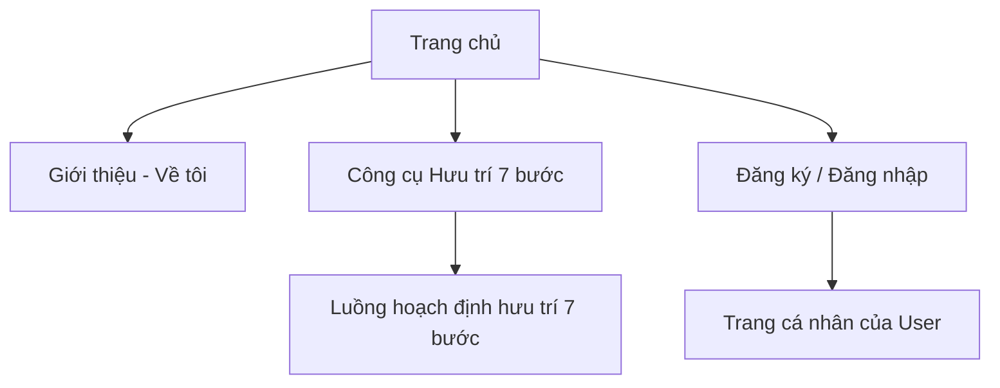
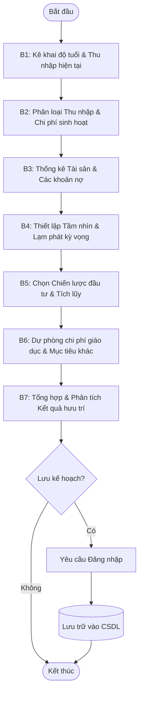

# Product Requirements Document (PRD) - Kim Hương Finance

**Project Name:** Kim Hương Finance  
**Version:** 1.0  
**Status:** In Development  
**Author:** Tran Thi Ngoc Huyen (BA Intern)

---

## 1. Product Overview

### 1.1 Purpose
Kim Hương Finance is a specialized financial planning platform designed to help users build a sustainable and secure future through retirement planning. The website serves two primary purposes:
1.  **Personal Branding:** Showcasing the expertise and mission of **Kim Hương (Sarah)** in the finance industry.
2.  **Fintech Utility:** Providing a sophisticated, 7-step retirement calculation engine that transforms complex financial variables into actionable insights.

### 1.2 Core Value Proposition
- **Trust & Reliability:** Professional financial advice backed by an accurate calculation engine.
- **Clarity:** Simplifying retirement planning into a guided, 7-step process.
- **Personalization:** Tailored results based on individual income, expenses, and investment strategies.

---

## 2. Target Audience & User Roles

| Role | Description |
| --- | --- |
| **Visitor (Guest)** | Can browse the Home and About pages, use the 7-step calculator, and see general results. |
| **Registered User** | Can do everything a Guest can do, plus: save calculation results to their profile and view history. |
| **Administrator** | Responsible for system oversight, managing the user database, and reviewing calculation histories for advisory purposes. |

---

## 3. Sitemap & Navigation

- **Home Page:** Hero section, mission statement, featured tools.
- **About Page:** Professional biography, experience, and contact info.
- **Retirement Calculator:** The main logic engine.
- **Authentication:** Standard Login/Register/Password Recovery.

---

## 4. Functional Requirements

### 4.1 The 7-Step Retirement Calculator
The core of the website follows a logical, step-by-step flow based on the "Kim Huong Finance Use Case":

| Step | Name | Description | Key Inputs |
| --- | --- | --- | --- |
| **Step 1** | Cùng Bắt Đầu | Basic demographic and retirement goals. | Current Age, Retirement Age, Goal Income. |
| **Step 2** | Thu nhập & Chi phí | Monthly cashflow analysis. | Salary, Business Income, Essential/Lifestyle Costs. |
| **Step 3** | Tài sản & Nợ | Current net worth assessment. | Real Estate, Stocks, Savings, Loans, Debt. |
| **Step 4** | Tầm nhìn Nghỉ hưu | Defining the future lifestyle. | Living style (Luxury/Basic), Expect inflation. |
| **Step 5** | Chiến lược Tiết kiệm | Investment risk appetite. | Risk profile (Safe/Aggressive), Expected return. |
| **Step 6** | Kế hoạch Giáo dục | Specific provisions for dependents. | Tuition fees, Education timeframes. |
| **Step 7** | Tương lai của Bạn | Final analysis and results display. | Net worth at retirement, Readiness Score. |

### 4.2 Calculation Logic Flow (BPMN)

### 4.3 Administrator Features
- **User Management:** View, edit, or disable user accounts.
- **Calculation History:** View historical input data and results generated by users to provide personalized consulting.

---

## 5. Non-Functional Requirements

### 5.1 Accuracy (Critical)
- All financial calculations (FV - Future Value, NPV - Net Present Value, Inflation adjustments) must match the independently verified **Excel shadow model** with 100% precision.

### 5.2 Performance
- The 7-step process must feel instantaneous. Calculation updates should happen in real-time (< 500ms response) as users adjust inputs.
- Page load time (LCP) should be under **2 seconds**.

### 5.3 Security & Privacy
- Sensitive financial data (income, debt) must be protected.
- User authentication must follow industry best practices (JWT, secure storage).

---

## 6. Technical Stack

- **Frontend:** React / Next.js (for SEO and SSR performance).
- **Styling:** Tailwind CSS (Responsive mobile-first design).
- **Data Visualization:** Recharts or Chart.js (Interactive financial growth charts).
- **Backend/Database:** Vercel / Supabase (or similar cloud infrastructure for stability).
- **Version Control:** Git / GitHub.

---

## 7. Design Guidelines (UI/UX)

Derived from the **Sterling Ledger** design system:

- **Primary Color:** `#1E3A5F` (Deep Blue) - Used for navigation and core headers to build trust.
- **Secondary Color:** `#DC2626` (Action Red) - Used for Call-to-Action (CTA) buttons and critical highlights.
- **Tertiary & Neutral:** `#666666` (Gray) and `#F8F8F8` (Light Gray) for backgrounds and body text.
- **Typography:**
    - **Headlines:** Serif fonts (for a premium, established look).
    - **Body:** Sans-serif fonts (for modern readability).

---

## 8. Development Roadmap

1.  **Phase 1:** Requirement Analysis & Logic Formalization (Status: DONE).
2.  **Phase 2:** PRD, Sitemap & UX/UI Mockups (Status: DONE).
3.  **Phase 3:** Development (Sprint cycles based on Agile model).
4.  **Phase 4:** UAT, Bug Tracking, and Cross-verification with Excel Model.
5.  **Phase 5:** Handoff and Deployment.
